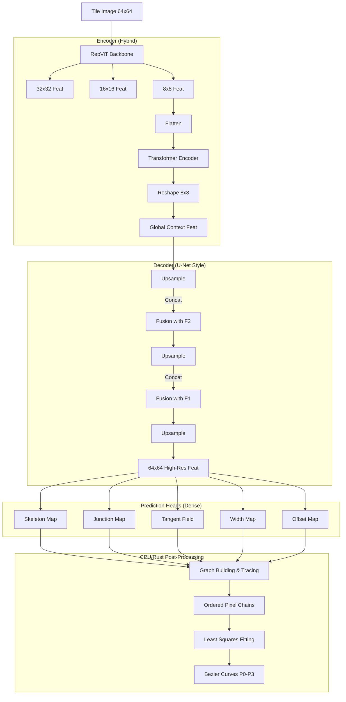

# InkTrace V4 架构设计说明书：密集预测与图重建 (Dense Prediction & Graph Reconstruction)

**版本**: 1.2 (Final Paradigm)
**日期**: 2026-01-29
**关键词**: 密集预测 (Dense Prediction), 骨架提取 (Skeletonization), 图算法 (Graph Algorithms), 最小二乘拟合

---

## 1. 核心理念 (Core Philosophy)

1.  **分而治之 (Divide and Conquer)**:
    *   **神经网络**: 只负责“看”。将输入图像转化为像素级的语义特征图 (Skeleton, Junction, Tangent, etc.)。这是深度学习最擅长的任务。
    *   **确定性算法**: 负责“建”。利用并查集、图搜索等经典算法构建拓扑；利用最小二乘法拟合几何曲线。这是传统算法最擅长的领域。

2.  **显式拓扑 (Explicit Topology)**:
    *   放弃让模型通过 Attention 隐式学习拓扑。
    *   显式地将图像转化为图结构 $G=(V, E)$，其中 $V$ 是 Junction，$E$ 是 Skeleton Chain。

3.  **确定性拟合 (Deterministic Fitting)**:
    *   不让神经网络猜参数。
    *   通过 Skeleton 获取有序像素点集，通过 Tangent Field 辅助排序，最后用数值方法精准拟合贝塞尔控制点。

---

## 2. 整体架构 (System Architecture)

模型采用 **Hybrid U-Net** 结构，包含 RepViT Backbone, Global Transformer Context 以及多尺度特征融合解码器。

### 2.1 数据流图

---

## 3. 详细模块设计 (Module Design)

### 3.1 Encoder: Global Context Enhanced RepViT

**功能**: 提取多尺度特征，并通过 Transformer 增强全局感受野。

*   **Input**: `[B, 1, 64, 64]`
*   **Backbone**: Phase 1 RepViT (复用权重)。
*   **Context Module**:
    *   Input: `[B, 64, 128]` (8x8 flattened)
    *   Block: 2-4 layers Transformer Encoder
    *   Output: `[B, 64, 128]` (Reshape back to 8x8)
    *   *目的*: 让局部特征感知全局拓扑，哪怕在 64x64 的小图上也很重要。

### 3.2 Decoder: Detail-Preserving U-Net

**功能**: 逐步恢复分辨率，精确到像素级。

*   **Structure**:
    *   `8x8` -> `16x16`: Upsample + Concat(F2) + Conv
    *   `16x16` -> `32x32`: Upsample + Concat(F1) + Conv
    *   `32x32` -> `64x64`: Upsample + Conv
*   **Fusion Strategy**: `Concat + Conv` 保留更多高频细节。
*   **Deep Supervision**: 在中间层 (16x16, 32x32) 添加辅助 Skeleton Loss，强迫模型从粗尺度就关注骨架。

### 3.3 Prediction Heads (The "Sensors")

模型输出 5 张与原图同尺寸的特征图：

1.  **Skeleton Map (骨架图)**
    *   `[B, 1, 64, 64]`, Sigmoid
    *   含义: 像素是否在笔画中心线上。
    *   Loss: BCE + Dice (解决正负样本不平衡)。

2.  **Junction Map (节点图)**
    *   `[B, 1, 64, 64]`, Sigmoid
    *   含义: 像素是否是端点或交叉点。
    *   Loss: MSE (Gaussian Heatmap GT)。

3.  **Tangent Field (切向场)**
    *   `[B, 2, 64, 64]`, Tanh
    *   含义: 每个 skeleton 像素处的笔画方向单位向量 $(cos\theta, sin\theta)$。
    *   Loss: Cosine Similarity Loss (只监督 Skeleton 区域)。

4.  **Width Map (宽度图)**
    *   `[B, 1, 64, 64]`, ReLU
    *   含义: 每个 skeleton 像素处的笔画宽度。
    *   Loss: L1 Loss (只监督 Skeleton 区域)。

5.  **Offset Map (偏移图)**
    *   `[B, 2, 64, 64]`, Tanh
    *   含义: 像素中心到真实骨架中心的亚像素偏移 $(\delta x, \delta y)$。
    *   Loss: L1 Loss (只监督 Skeleton 区域)。

### 3.4 Post-Processing (The "Builder")

这部分是纯算法逻辑，建议用 Rust (`ink_trace_rs`) 实现以保证性能。

1.  **Graph Construction**:
    *   利用 Junction Map 提取节点 $V$。
    *   利用 Skeleton Map 提取边 $E$。
    *   构建无向图 $G=(V, E)$。

2.  **Path Tracing (BFS/DFS)**:
    *   从每个节点出发，沿着 Skeleton 像素游走。
    *   利用 Offset Map 修正像素坐标，得到亚像素点链。
    *   利用 Tangent Field 解决交叉路口的歧义。

3.  **Curve Fitting**:
    *   对每条提取出的点链，结合 Width Map。
    *   使用 **最小二乘法 (Least Squares)** 拟合三次贝塞尔曲线参数 $P_0, P_1, P_2, P_3$。
    *   约束条件: $P_0, P_3$ 必须位于路径端点。

---

## 4. 训练策略 (Training Strategy)

### 4.1 GT 生成 (Data Pipeline)
需要修改 `dataset.py`，在线生成 Dense GT Maps。
*   利用 Rust 渲染引擎，在渲染时直接生成 Skeleton, Distance Transform (Width), Tangent 等 buffer。
*   无需复杂的序列化/Tokenization。

### 4.2 Loss Function
$$L = \lambda_1 L_{skel} + \lambda_2 L_{junc} + \lambda_3 L_{tan} + \lambda_4 L_{width} + \lambda_5 L_{offset}$$
建议权重: Skeleton 最重要 (10.0), Junction 次之 (5.0), 其余辅助 (1.0)。

### 4.3 Phase 规划
*   **Phase 1**: Encoder Pretraining (直接复用)。
*   **Phase 2**: Dense Head Training. 冻结 Encoder，训练 Decoder 和 Heads。
*   **Phase 3**: End-to-End Finetuning.

---

## 5. 项目路线图 (Roadmap)

### Step 1: 数据准备 (Rust Side)
*   [ ] 扩展 Rust 渲染器，支持输出 Skeleton Map, Junction Map, Tangent Map 等 Buffer。

### Step 2: 模型搭建 (Python Side)
*   [ ] 实现 `DenseVectorNet` (Encoder + U-Net Decoder + Heads)。
*   [ ] 定义多任务 Loss 函数。

### Step 3: 训练验证
*   [ ] 跑通单个 Batch 的过拟合。
*   [ ] 可视化所有 Head 的输出，确保 GT 正确。

### Step 4: 后处理实现
*   [ ] 实现 Python 版原型 (Graph builder + Fitter)。
*   [ ] 移植到 Rust (`ink_trace_rs`) 加速。

