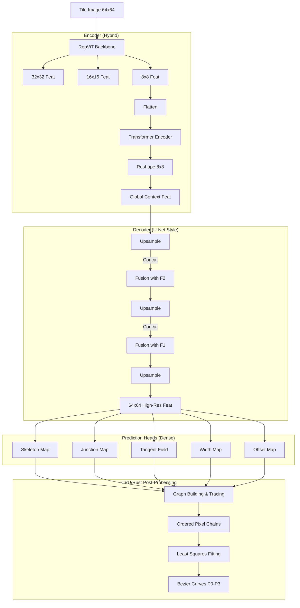

# InkTrace V5 架构设计说明书：密集预测与图重建 (Dense Prediction & Graph Reconstruction)

**关键词**: 密集预测 (Dense Prediction), 骨架提取 (Skeletonization), 图算法 (Graph Algorithms), 最小二乘拟合

---

## 0. 项目背景与意义 (Context & Significance)

### 0.1 行业背景 (Industry Background)
墨迹（Ink Traces）不仅仅是黑白像素的集合，它们承载着书法、水墨画、历史文献乃至现代设计手稿的文化与艺术精髓。在数字化浪潮中，现有的存储形式多为光栅图像（Bitmap, e.g., PNG/JPG）。
*   **痛点**: 光栅图像在放大时会出现锯齿模糊（失真），在进行字体设计、激光雕刻、三维建模或动画制作时，缺乏必要的几何信息。
*   **需求**: 将光栅墨迹转化为数学上可编辑、无限分辨率的**矢量曲线（Vectorization）**，是连接物理书写与数字创作的关键桥梁，在数字人文保护、计算机辅助设计 (CAD) 和创意产业中具有重要价值。

### 0.2 技术挑战 (Technical Challenges)
传统的矢量化方案（如 Potrace, Adobe Image Trace）和早期的深度学习方法面临以下核心难题：
1.  **复杂拓扑与遮挡 (Topology & Occulusion)**: 墨迹常包含交叉笔画、回锋和粘连。传统基于边缘追踪（Contour Tracing）的算法无法区分“笔画交叉”与“形状融合”，导致拓扑结构错误，生成的矢量图难以进行笔画级编辑。
2.  **物理质感丢失 (Texture vs. Geometry)**: 真实的毛笔书写包含**飞白 (Dry Brush)**、**晕染 (Diffusion)** 和**笔锋变化 (Tapering)**。简单的轮廓提取会产生大量细碎的噪点路径，而非平滑的运笔轨迹。
3.  **计算资源限制 (Constraints)**: 现有的高性能矢量化模型（如基于Transformer的序列生成模型）往往依赖高端 GPU，推理延迟高，难以部署在消费级 CPU/核显设备或移动端应用中。

### 0.3 InkTrace 的价值 (Value Proposition)
InkTrace 旨在构建一个**轻量级、高保真、结构感知**的端到端矢量化系统。它不仅仅是“描边”，更是在进行“逆向书写过程还原” (Inverse Rendering)。
*   **结构感知 (Structure-Aware)**: 通过恢复笔画的中轴骨架（Skeleton）和逻辑连接，还原书写的时序逻辑，而非仅仅拟合外观。
*   **极致轻量 (Efficiency)**: 专为 **CPU / 核显** 环境优化。通过独特的 "Hybrid U-Net" 架构设计，在保持高精度的同时，大幅降低计算量，使实时推理成为可能。
*   **无限数据闭环 (Data Loop)**: 基于物理仿真的在线数据合成系统，彻底解决了矢量化任务中“成对数据（Pair Data）”获取难的问题，实现了数据生成的自给自足。
*   **技术范式创新**: 探索 **"Deep Learning for Perception, Algorithms for Reasoning"** 的混合范式。让神经网络负责其擅长的模糊感知（语义分割），让确定性图算法负责逻辑推理（拓扑构建）和几何拟合（贝塞尔曲线），实现了鲁棒性与精确性的最佳平衡。

### 0.4 项目目标 (Project Goals)
*   **Input**: 任意分辨率的手写文字/草图图像（分块处理）。
*   **Output**: 带有**变宽属性（Variable Width）**的三次贝塞尔曲线路径（SVG/PDF）。
*   **Quality**: 笔画平滑自然，交叉处拓扑分离正确，飞白区域拟合为主要笔势而非噪点。
*   **Performance**: 在普通笔记本 CPU 上实现流畅推理。

---

## 1. 核心理念 (Core Philosophy)

1.  **分而治之 (Divide and Conquer)**:
    *   **神经网络**: 只负责“看”。将输入图像转化为像素级的语义特征图 (Skeleton, Junction, Tangent, etc.)。这是深度学习最擅长的任务。
    *   **确定性算法**: 负责“建”。利用并查集、图搜索等经典算法构建拓扑；利用最小二乘法拟合几何曲线。这是传统算法最擅长的领域。

2.  **显式拓扑 (Explicit Topology)**:
    *   放弃让模型通过 Attention 隐式学习拓扑。
    *   显式地将图像转化为图结构 $G=(V, E)$，其中 $V$ 是 Junction，$E$ 是 Skeleton Chain。

3.  **确定性拟合 (Deterministic Fitting)**:
    *   不让神经网络猜参数。
    *   通过 Skeleton 获取有序像素点集，通过 Tangent Field 辅助排序，最后用数值方法精准拟合贝塞尔控制点。

---

## 2. 整体架构 (System Architecture)

模型采用 **Hybrid U-Net** 结构，包含 RepViT Backbone, Global Transformer Context 以及多尺度特征融合解码器。

### 2.1 数据流图

---

## 3. 详细模块设计 (Module Design)

### 3.1 Encoder: Global Context Enhanced RepViT (Coordinate Aware)

**功能**: 提取多尺度特征，并通过 Transformer 增强全局感受野。

*   **Input**: `[B, 1, 64, 64]` -> **Coordinate Injection** -> `[B, 3, 64, 64]` (Gray + X + Y)
    *   *改进*: 引入 CoordConv 思想，显式注入归一化坐标 $(-1, 1)$，使卷积层具备绝对位置感知能力，提升对几何形状（如笔画端点、绝对位置）的敏感度。
*   **Backbone**: Phase 1 RepViT (复用权重)。
*   **Context Module**:
    *   Input: `[B, 64, 128]` (8x8 flattened)
    *   Block: 2-4 layers Transformer Encoder
    *   Output: `[B, 64, 128]` (Reshape back to 8x8)
    *   *目的*: 让局部特征感知全局拓扑，哪怕在 64x64 的小图上也很重要。

### 3.2 Decoder: Detail-Preserving U-Net

**功能**: 逐步恢复分辨率，精确到像素级。

*   **Structure**:
    *   `8x8` -> `16x16`: Upsample(Bilinear) + Attention Gate(F2) + Conv
    *   `16x16` -> `32x32`: Upsample(Bilinear) + Attention Gate(F1) + Conv
    *   `32x32` -> `64x64`: Upsample(Bilinear) + Conv(Refinement)
*   **Upsampling Strategy**: 放弃 `ConvTranspose`，采用 `nn.Upsample(mode='bilinear')` + Convolution (如 RepVGG Block) 以消除棋盘格伪影。
*   **Fusion Strategy**: 引入 **Attention Gate (AG)** 或 SE-Block。让深层特征“指导”浅层特征的选择，抑制背景噪声，聚焦骨架区域。
*   **Deep Supervision**: 不仅在最终 64x64 输出，也在中间层 (16x16, 32x32) 添加辅助 Skeleton Head。强迫 Transformer 和 Encoder 在早期就必须捕获骨架结构，而不仅仅是将压力堆积在最后一层。

### 3.3 Prediction Heads (The "Sensors")

模型输出 5 张与原图同尺寸的特征图：

1.  **Skeleton Map (骨架图)**
    *   `[B, 1, 64, 64]`, Sigmoid
    *   含义: 像素是否在笔画中心线上。
    *   Loss: BCE + Dice (解决正负样本不平衡)。

2.  **Junction Map (节点图)**
    *   `[B, 1, 64, 64]`, Sigmoid
    *   含义: 像素是否是端点或交叉点。
    *   Loss: MSE (Gaussian Heatmap GT)。

3.  **Tangent Field (切向场)**
    *   `[B, 2, 64, 64]`, Tanh
    *   含义: 每个 skeleton 像素处的笔画方向的双倍角向量 $(\cos 2\theta, \sin 2\theta)$。
    *   优势: 消除 $0^{\circ}$ 与 $180^{\circ}$ 的方向模糊性 (Orientation Ambiguity)，使预测空间连续。
    *   Loss: Cosine Similarity Loss 或 L2 Loss (只监督 Skeleton 区域)。

4.  **Width Map (宽度图)**
    *   `[B, 1, 64, 64]`, ReLU
    *   含义: 每个 skeleton 像素处的笔画宽度。
    *   Loss: L1 Loss (只监督 Skeleton 区域)。

5.  **Offset Map (偏移图)**
    *   `[B, 2, 64, 64]`, Tanh
    *   含义: 像素中心到真实骨架中心的亚像素偏移 $(\delta x, \delta y)$。
    *   Loss: L1 Loss (只监督 Skeleton 区域)。

### 3.4 Post-Processing (The "Builder")

这部分是纯算法逻辑，建议用 Rust (`ink_trace_rs`) 实现以保证性能。

1.  **Graph Construction**:
    *   利用 Junction Map 提取节点 $V$。
    *   利用 Skeleton Map 提取边 $E$。
    *   构建无向图 $G=(V, E)$。

2.  **Path Tracing (BFS/DFS)**:
    *   从每个节点出发，沿着 Skeleton 像素游走。
    *   利用 Offset Map 修正像素坐标，得到亚像素点链。
    *   利用 Tangent Field 解决交叉路口的歧义。

3.  **Curve Fitting**:
    *   对每条提取出的点链，结合 Width Map。
    *   使用 **最小二乘法 (Least Squares)** 拟合三次贝塞尔曲线参数 $P_0, P_1, P_2, P_3$。
    *   约束条件: $P_0, P_3$ 必须位于路径端点。

---

## 4. 训练策略 (Training Strategy)

### 4.1 GT 生成 (Data Pipeline)
需要修改 `dataset.py`，在线生成 Dense GT Maps。
*   利用 Rust 渲染引擎，在渲染时直接生成 Skeleton, Distance Transform (Width), Tangent 等 buffer。
*   无需复杂的序列化/Tokenization。

### 4.2 Loss Function
$$L = \lambda_1 L_{skel} + \lambda_2 L_{junc} + \lambda_3 L_{tan} + \lambda_4 L_{width} + \lambda_5 L_{offset}$$
建议权重: Skeleton 最重要 (10.0), Junction 次之 (5.0), 其余辅助 (1.0)。

### 4.3 Phase 规划
*   **Phase 1: Encoder Pretraining (已完成)**
    *   **架构**: RepViT-M0.9 (Stage 1-3) + Pixel Decoder (Simple ConvTranspose).
    *   **任务**: 自监督 Autoencoder 图像重构 (MSE Loss).
    *   **现状**: 已验证能够精准还原笔画细节，证明 Encoder 具备良好的特征提取能力。
    *   **动作**: 冻结 Backbone 权重，作为 V4 架构的特征提取器。

*   **Phase 2: Dense Head Training (进行中)**
    *   **架构**: Frozen Encoder + Hybrid U-Net Decoder + 5 Dense Heads.
    *   **任务**: 监督学习 (Dense Prediction)，拟合 Skeleton/Junction/Tangent/Width/Offset Maps。
    *   **数据**: 使用 `DenseInkTraceDataset` 在线生成。

*   **Phase 3: End-to-End Finetuning**
    *   解冻 Encoder，进行全模型微调，适应极端数据情况。

---

## 5. 项目路线图 (Roadmap)

### Step 1: 数据准备 (Rust Side)
*   [x] 扩展 Rust 渲染器，支持输出 Skeleton Map, Junction Map, Tangent Map 等 Buffer。

### Step 2: 模型搭建 (Python Side)
*   [x] 实现 `DenseVectorModel` (Encoder + U-Net Decoder + Heads)。
*   [x] 定义多任务 Loss 函数。

### Step 3: 训练验证
*   [ ] 跑通单个 Batch 的过拟合。
*   [ ] 可视化所有 Head 的输出，确保 GT 正确。

### Step 4: 后处理实现
*   [ ] 实现 Python 版原型 (Graph builder + Fitter)。
*   [ ] 移植到 Rust (`ink_trace_rs`) 加速。

