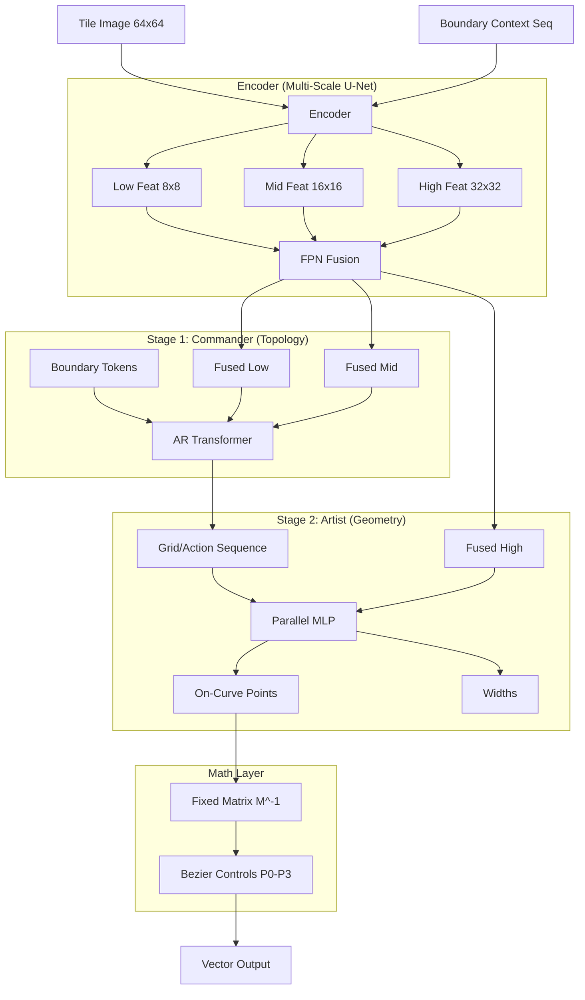

# InkTrace V4 架构设计说明书：混合自回归矢量化 (Hybrid Autoregressive Vectorization)

**版本**: 1.1 (Refined)
**日期**: 2026-01-29
**关键词**: 矢量化 (Vectorization), 贝塞尔曲线 (Bezier Curves), 自回归 (Autoregressive), 拓扑几何解耦, 物理连续性

---

## 1. 项目背景与问题定义 (Project Context)

### 1.1 项目目标
**InkTrace** 旨在构建一个像人类一样“看图写字”的矢量化引擎。
*   **输入**: $64 \times 64$ 像素的灰度光栅图像 (Tile)。
*   **输出**: 具有精确拓扑结构的 **三次贝塞尔曲线 (Cubic Bezier Curves)** 序列及其笔画宽度。
*   **核心约束**: 必须保证跨 Tile 的线条 **$C^0$ 物理连续** (即上一块砖的终点必须严格等于下一块砖的起点)，杜绝传统矢量化算法中的断裂和错位问题。

### 1.2 现有痛点 (Why V4?)
在之前的尝试 (Phase 2 DETR) 中，我们遇到了以下瓶颈：
1.  **虚点预测难**: 神经网络难以预测位于画面外的贝塞尔控制点 ($P_1, P_2$)，导致大曲率线条拟合失败。
2.  **拓扑断裂**: 并行预测无法保证 $P_{t, start} == P_{t-1, end}$，且 Tile 拼接处存在明显缝隙。
3.  **计算资源**: 需在 Consumer GPU (RTX 5090) 及 CPU 上实现高并发处理，需避免沉重的全图 Attention。

---

## 2. 核心设计哲学 (Core Philosophy)

1.  **实点替代虚点 (On-Curve Points Supremacy)**: 
    *   放弃直接预测抽象的控制点。改为预测曲线上 **真实的 4 个采样点** (Start, 1/3, 2/3, End)。
    *   利用固定数学矩阵将实点瞬间转换为贝塞尔控制点。
    *   *收益*: 将几何推理降维为视觉定位，解决“控制点溢出”问题。

2.  **拓扑与几何解耦 (Topology-Geometry Decoupling)**:
    *   **Stage 1 (Commander)**: 只负责“指挥”笔画走哪个网格 (16x16 Grid)。
    *   **Stage 2 (Artist)**: 负责在选定网格内“描绘”精确坐标。
    *   *收益*: 极短的序列长度 (~30 tokens) + 极高的几何精度。

3.  **拼图即条件 (Stitching as Condition)**:
    *   采用 **Zig-Zag 扫描**，将上一个 Tile 的断点作为 **Prompt (提示)** 喂给下一个 Tile。
    *   *收益*: 以前置约束替代后处理拼接，物理保证连续性。

---

## 3. 整体架构 (System Architecture)

模型采用 **Boundary-Aware U-Net Encoder** + **Dual-Stage Decoder** 结构。

### 3.1 数据流图

---

## 4. 详细模块设计 (Module Design)

### 4.1 模块 A: Boundary-Aware Multi-Scale Encoder

**功能**: 提取多尺度特征，并强力注入边界条件。

*   **输入**:
    *   Image: `[B, 1, 64, 64]` (训练时建议 Pad 到 72x72 以提供 Context)
    *   Boundary Prompts: `[B, N, 3]`。列表包含所有从相邻 Tile 传入的断点 $(x, y)$ 及进入向量 $(vx, vy)$。
*   **结构**:
    *   **U-Net Backbone**: 复用 Phase 1 RepViT 权重。
    *   **Boundary Encoder**: 一个小型 MLP 将 Prompt 编码为 Token 序列。
    *   **Scale Fusion**: 使用 FPN (Feature Pyramid Network) 融合 32x32, 16x16, 8x8 特征。
    *   **Injection**: 在 FPN 融合前，通过 Cross-Attention 将 Boundary Tokens 注入到底层特征 (`F_Low`) 中。

### 4.2 模块 B: Topology Commander (Stage 1)

**功能**: 决策中心。确定笔顺、结构和连接关系。

*   **架构**: Causal Transformer Decoder (GPT-style)。
*   **词表设计 (Vocabulary)**:
    *   `Grid_ID` (0-255): 对应 16x16 网格位置。
    *   `PEN_LIFT` (特殊的 Action): 表示当前笔画结束，抬笔。
    *   `EOS`: 表示当前 Tile 所有内容绘制完毕。
    *   `SOS`: 起始符 (通常由 Boundary Token 充当)。
*   **工作流**:
    1.  接收 Boundary Token 作为 Prompt。
    2.  自回归生成: `[Grid_45, Grid_46, Grid_62, PEN_LIFT, Grid_10, ..., EOS]`。
    3.  此阶段不生成坐标，只生成意图。

### 4.3 模块 C: Geometry Artist (Stage 2)

**功能**: 执行中心。并行计算亚像素精度。

*   **架构**: Non-Autoregressive MLP (并行)。
*   **输入**:
    *   Grid Sequence (Stage 1 的输出)。
    *   Local Context: 根据 Grid ID 从 `F_High` (32x32) 中采样的局部视觉特征。
*   **输出头**:
    1.  **On-Curve Head**: 输出 $4 \times 2$ 个值，代表 $\{P_{start}, P_{1/3}, P_{2/3}, P_{end}\}$ 相对于 **Grid 中心** 的偏移量 (Offset)。
    2.  **Width Head**: 输出 $\{w_{start}, w_{end}\}$。

### 4.4 模块 D: Math Transform Layer

**功能**: 纯数学确定性映射。

*   **原理**: 已知三次贝塞尔曲线 $B(t)$ 在 $t=\{0, 1/3, 2/3, 1\}$ 四处的点，反解控制点 $P_0, P_1, P_2, P_3$。
*   **公式**:
    $$ \mathbf{P}_{control} = \mathbf{M}^{-1} \cdot \mathbf{P}_{on\_curve} $$
*   **矩阵 $\mathbf{M}^{-1}$** (预计算常数):
    该矩阵一定可逆。推理时由 GPU/CPU 进行一次矩阵乘法即可。

---

## 5. 推理与抗漂移策略 (Inference & Drift Mitigation)

### 5.1 Zig-Zag 扫描与边界传递

1.  **扫描顺序**: 蛇形扫描 (Zig-Zag) 遍历所有 Tile。
2.  **状态传递**:
    *   Tile $T_i$ 推理完成后，计算其与右侧 $T_{i+1}$ 和下方 $T_{row+1}$ 的交点。
    *   这些交点不仅仅是坐标值，还包含**切线方向**。
    *   将这些信息打包成 Boundary Prompts 传递给下一个 Tile。

### 5.2 抗漂移设计 (Overlapped Context)

*   **风险**: 误差可能会随 Tile 传递累积。
*   **解决方案**: **Context Padding**。
    *   输入 Tile 虽然负责重建 $64 \times 64$ 中心区域，但实际 Crop 图像时取 $80 \times 80$ (四周各扩 8px)。
    *   Encoder 可以“看到”相邻 Tile 的一部分墨水。
    *   当传入的 Boundary Prompt 稍微偏离墨水中心时，模型能依据 Padding 中的视觉信息，在当前 Tile 内部迅速将线条“拉回”墨水中心。

---

## 6. 训练规划 (Training Strategy)

### Phase 1: Encoder Adaptation
*   复用 Phase 1 权重，添加 FPN 和 Boundary Encoder。
*   冻结 Backbone，训练 FPN 和 Boundary Injection。

### Phase 2: Topology Pretraining
*   数据: 使用 Rust 生成器生成大量 Grid 序列离散标签。
*   任务: 训练 Stage 1 Commander (Cross-Entropy Loss)。
*   目标: 所有的笔顺、结构、拓扑连接必须在此阶段学会。

### Phase 3: Geometry Tuning
*   数据: 使用 Render 出来的实点坐标。
*   任务: 冻结 Stage 1，训练 Stage 2 Artist (L1 Loss)。
*   目标: 学会精准的描线和宽度预测。

### Phase 4: Joint Finetuning
*   全参数微调，可能引入真实的 TTF 字体数据进行域适应。

